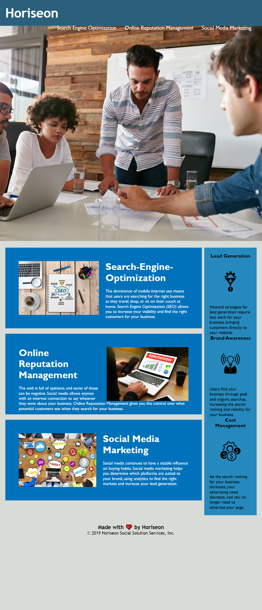

# Homework-HTML-Git-CSS

# HTML_CSS_Refractor

# Deployed Link

<a href= "https://tmgorogers.github.io/testingRepo"/>

<h1>Project Description</h1>

This week's homework assignment involves a very important aspect of web development in "Accessibility". It's providing a user a better way to navigate and interact with the website.  I reworked the CSS to make it more efficient by consolidating CSS selectors and properties, organizing them to follow the semantic structure of the HTML elements, and including comments before each element. Replacing semantic tags provides context to screen readers.

 

